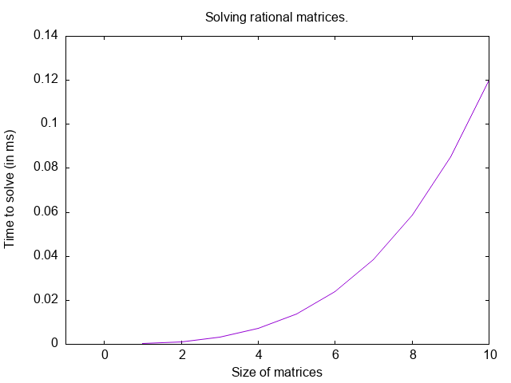
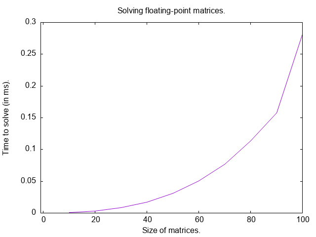

# AM 9563 - Assignment 1
### Kumar S. Shukla, 251254477

---

 1. Implement the Extended Euclidean Algorithm for Z. Given a, b your
    implementation should compute the vectors of ri, qi, si and ti as in the
    course slides.

 The Extended Euclidean algorithm is implemented in `nt.c`, with the name `xgcd`.

 **Usage:** `xgcd(&u, &v, a, b, print_flag)`

 **Input:**
  `u`, `v`: pointers to integers (which will eventually store the Bezout coefficients)
  `a`, `b`: integers (to compute gcd of)
  `print_flag`: an integer flag, to decide whether to print intermediate values

 **Output:**
  The function returns the gcd of `a` and `b`, and sets `*u`, `*v` to the Bezout
  coefficients of `a` and `b` such that `ua + vb = gcd(a, b)`. If the
  `print_flag` is set to be non-zero, then, the intermediate values `r_i, q_i,
  s_i, t_i` will be printed.

---

 2. Using the Extended Euclidean Algorithm code you have, implement
    BezoutCoefficients: when given two integers a, b, this procedure returns
    the Bézout Coefficients s, t so that sa + tb = gcd(a, b).

 The Extended Euclidean algorithm is implemented in `nt.c`, with the name `xgcd`.
 The function sets the Bezout coefficients as explained above.

---

 3. (Graduate Students) Implement the Chinese Remainder Algorithm, making use of
    your implementation of BezoutCoefficients.

 The Chinese Remainder Algorithm is implemented in `nt.c`, with the name `crt`.

 **Usage:** `crt(rems[], moduli[], n)`

 **Input:**
 `rems`, `moduli`: arrays of (pointers to) integers, the moduli pairwise coprime
 `n`: number of congruences

 **Output:**
 The function solves the congruences `x = rems[0] (mod moduli[0])`,
 `x = rems[1] (mod moduli[1])`, ..., `x = rems[n-1] (mod moduli[n-1])`
 and returns the unique solution mod
 `moduli[0] * moduli[1] * ... * moduli[n-1]`.

---

 4. Write 3264 in its binary representation.

 The function to compute the binary representation of an integer is implemented
 in `nt.c`, with the name `bin_rep`.

 **Usage:** `bin_rep(rep[], n)`

 **Input:**
 `rep`: an array of (pointer to) bytes (yes, bytes not bits)
 `n`: a positive integer

 **Output:**
 The function sets the binary representation of `n` in `rep[]`
 and returns the number of bits.

 `bin_rep(rep, 3264)` returns `12` and sets `rep` to
  `110011000000`

---

 5. Find the Bézout coefficients for 123456 and 654321

 `xgcd(&u, &v, 123456, 654321, 0)`
  `u = -46741`
  `v = 8819`

---

 6. Use your Extended Euclidean Algorithm implementation to write 1234/4321 as a
    continued fraction.

 The function to compute the continued fraction representation of a rational number
 is implemented in `nt.c`, called `QQ_cont_frac`.

 **Usage:** `QQ_cont_frac(out[], &q)`

 **Input:**
 `out`: an array of integers (which will store the partial quotients)
 `q`: pointer to a rational number

 **Output:**
 The function sets `out[]` to the partial quotients `a_0, a_1, ..., a_k` of the
 continued fraction `q = [a_0; a_1, ..., a_k]` and returns their number, `k + 1`.

 The partial quotients are exactly the quotients `q_i` computed by the Extended
 Euclidean Algorithm on the numerator and denominator of `q`.

 `1234/4321 = [3, 1, 1, 153, 1, 3]`

---

 7. (Graduate Students) Using your Chinese Remainder Algorithm implementation,
    find a nonnegative integer less than 2310 = 2 · 3 · 5 · 7 · 11 whose
    remainders on division by 2, 3, 5, 7 and 11 are 0, 0, 2, 6, and 9
    respectively.

 `crt(rems, moduli, 5)` with `rems = {0, 0, 2, 6, 9}` and
 `moduli = {2, 3, 5, 7, 11}` returns
  `2022`

---

 8. The n x n matrix whose (i, j)-th entry is 1/(i + j − 1) is the n-th Hilbert
    matrix, H_{n,n}.

    **(a)** Write a function which computes the n-th Hilbert matrix exactly,
    with entries in Q, and another which computes it numerically, with floating
    point entries.

    The functions are implemented in `la.c`, with the names `QQMat_hilbert`
    (exact) and `FMat_hilbert` (floating point).

 **Usage:** `QQMat_hilbert(&H, n)`, `FMat_hilbert(&H, n)`

 **Input:**
 `H`: pointer to a `QQMat` (resp. `FMat`), already allocated as an n x n matrix
 with `QQMat_init(&H, n, n)` (resp. `FMat_init(&H, n, n)`)
 `n`: size of the matrix

 **Output:**
 The function sets the (i, j)-th entry of `H` to `1/(i + j − 1)`, as an exact
 rational number (resp. as a `double`).

 **(b)** Define b = H_{10,10} · (1, 2, ..., 10)^T using exact rational
 arithmetic and solve the system H_{10,10} x = b exactly. Then convert both
 H_{10,10} and b to floating point representations and solve the resulting
 system numerically. State the floating point precision you used and comment on
 what you notice about the results.

 The systems are solved with `QQMat_solve` and `FMat_solve`, implemented in
 `la.c`.
 Both do Gaussian elimination on the augmented matrix `[H | b]`, using the
 `QQMat_gaussian` (and `FMat_gaussian`) which is the implementation of the
 Gaussian elimination pseudocode given in the lecture slides.

 **Usage:** `QQMat_solve(&x, &H, &b)`, `FMat_solve(&x, &H, &b)`

 **Input:**
 `x`: pointer to an (allocated) n x 1 matrix (which will store the solution)
 `H`: pointer to an invertible n x n matrix
 `b`: pointer to an n x 1 matrix

 **Output:**
 The function sets `x` to the solution of `Hx = b`.

 Computed exactly (with `QQMat_mul`), `b = H_{10,10} · (1, 2, ..., 10)^T` is
  `b = (10, 221209/27720, 94159/13860, 715867/120120, 479917/90090,`
  `347785/72072, 106081/24024, 1425857/350064, 386149/102102, 18266753/5173168)^T`

 and `QQMat_solve` recovers
  `x = (1, 2, 3, 4, 5, 6, 7, 8, 9, 10)^T`

 exactly.

 For the numerical solution, `H_{10,10}` and `b` were converted (with
 `QQ_to_dbl`) to C `double`s, a 53-bit precision floating-point representation
 (about 16 significant decimal digits). `FMat_solve` gives
 x = (1, 2, 3.00001, 3.9999, 5.00048, 5.99868, 7.00216, 7.99791, 9.0011, 9.99976)

 Even though every entry of `H_{10,10}` and `b` is correct to about 16 digits,
 some entries of the computed solution are correct to only 3 or 4 digits so
 about 12 digits were lost. The rounding errors made when converting
 `H_{10,10}` and `b` to floating point, and during the elimination, are
 amplified by a factor of up to `10^12`. Exact rational arithmetic makes no
 rounding errors, so it gives the exact answer, at the cost of numerators and
 denominators that grow during the computation (the entries of `b` already have
 denominators of up to 7 digits).

---

 9. Write a function RanZMat(m, n) which constructs an m x n matrix with random
    integer entries between 0 and 100. Write another function RanFMat(m, n)
    which constructs an m x n matrix with random floating point entries
    between 0 and 1.
    (a) Use a timing or benchmarking tool available in your system to measure
    the average time it takes to solve a system Ax = b where A is a random
    100 x 100 matrix and b is a random 100 x 1 vector. Compare systems
    generated using RanZMat with systems generated using RanFMat, using the
    same function to generate both A and b in each case.

 The functions are implemented in `la.c`, with the names `RanZMat` and `RanFMat`.

 **Usage:** `RanZMat(&A, m, n)`, `RanFMat(&A, m, n)`

 **Input:**
 `A`: pointer to a `QQMat` (resp. `FMat`), already allocated as an m x n matrix
 `m`, `n`: number of rows and columns

 **Output:**
 `RanZMat` sets the entries of `A` to random integers between 0 and 100 (stored
 as rationals, so that the system can be solved exactly over Q), and `RanFMat`
 sets them to random `double`s between 0 and 1. Both use the C library's
 `rand()`.

 **(a)** The timing tool used is the C standard library's `clock()` (from
 `<time.h>`), which measures CPU time. Only the calls to `QQMat_solve` /
 `FMat_solve` are timed, and the time is averaged over 1000 random systems.
 Everything was compiled with `gcc -O2` and run on an AMD Ryzen 5 PRO 4650U.

 `RanZMat`, 100 x 100: cannot be solved with this implementation. `ZZ` is a
 64-bit `long` currently, and the numerators and denominators of the entries
 grow quickly during the elimination: they overflow 64 bits already for n = 12.
 After an overflow the entries are garbage, and the program eventually crashes
 with a division by zero. Solving a `100 x 100` system exactly needs arbitrary
 precision integers which I will add in later versions of the program.

 However, we can extrapolate the runtime for `100 x 100` matrices from
 `10 x 10` matrices.

 

 The growth is cubic, as confirmed by the observed runtimes (also since our
 implementation of Gaussian elimination is O(n^3)). Since solving a `10 x 10`
 rational matrix takes 0.12ms. Solving a `100 x 100` matrix will take about
 `120ms`.

 Next for solving floating-point matrices, the observed runtimes are as
 follows:

 

 Solving a `100 x 100` floating-point matrices takes `0.28` ms (averaged over
 1000 systems).

 The exact solve is already about 200 times slower at n = 10, and the gap grows
 with n. Both do `O(n^3)` arithmetic operations, but a floating point operation
 is a single hardware instruction on fixed size numbers, while every rational
 operation needs gcd computations (to keep the fraction reduced), whose cost
 grows with the size of the numerators and denominators, which themselves grow
 during the elimination.

---

 10. (Graduate Students) Show that if A is an n x n matrix over a field F which
     has determinant not equal to zero, then for any b, defined over F, there
     is a solution to Ax = b defined over F. Give an example which shows that
     this is not true if one replaces F by Z.

 **Proof.** Let `adj(A)` be the adjugate of `A`: the `n x n` matrix whose
 `(i, j)`-th entry is the cofactor `(−1)^(i+j) det(A_ji)`, where `A_ji` is `A`
 with row j and column i removed. By the cofactor expansion,
 `A · adj(A) = adj(A)·A = det(A) I`
 (the diagonal entries are the expansions of `det(A)` along a row or column,
 and the off-diagonal entries are expansions of determinants of matrices with
 two equal rows or columns, which are 0).

 Since `F` is a field and `det(A) ≠ 0`, `det(A)` has an inverse `det(A)^-1` in
 `F`. Let
  `x = det(A)^-1 · adj(A) · b`

 The entries of `x` are sums of products of elements of `F`, so `x` is defined
 over `F`, and
  `Ax = det(A)^-1 · (A · adj(A)) · b = det(A)^-1 · det(A) · b = b`

 so `x` is a solution of `Ax = b` over `F`. (It is also unique: if
 `Ay = b`, then multiplying `A(x − y) = 0` on the left by `det(A)^-1 · adj(A)`
 gives `x − y = 0`.)

 **Counterexample over Z.** Take

 ```
 A = | 1   1 |      b = | 1 |
     | 1  -1 |          | 0 |
 ```

 Then `det(A) = −2 ≠ 0`, but `Ax = b` says `x_1 + x_2 = 1` and `x_1 − x_2 = 0`,
 whose only solution is `x = (1/2, 1/2)^T`, which is not defined over Z. The
 proof above breaks down because `det(A) = −2` has no inverse in Z. (Over Z,
 `Ax = b` has a solution for every b exactly when `det(A) = ±1`.)

---
